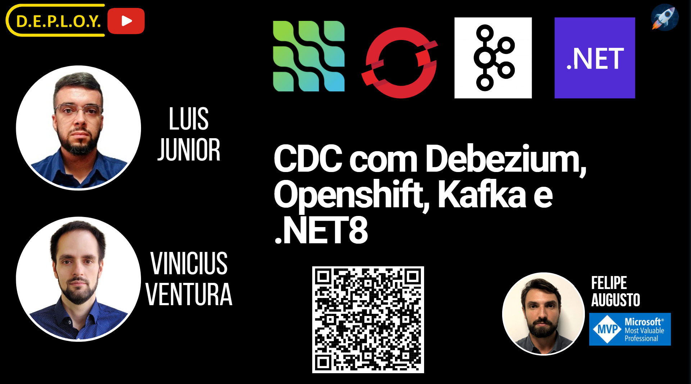

# App Writer

App Writer é uma aplicação projetada para consumir logs de Change Data Capture (CDC) gerados pelo Debezium a partir de um tópico do Kafka e persistir esses dados na base de dados de destino.

## Funcionalidades

- **Consumo de Logs do Kafka**: Consome dados de CDC de um tópico do Kafka.
- **Persistência de Dados**: Persiste os dados consumidos dinamicamente na base de dados de destino.
- **Suporte a Vários Bancos de Dados**: Compatível com diferentes bancos de dados para armazenamento dos dados, nesse momento está aberto para inclusão de implementações específicas de persistência em outras bases de dados, para esta live foi implementado o SQL Server

## Configuração

Configure as variáveis de ambiente => 
* TopicosTabelaKafka: lista de tópicos a serem consumidos;
* TipoBancoDestino: SqlServer;
* TipoPayload: Debezium;
* PodGuid: guid gerado manualmente para permitir consumo paralelo no kafka;
* Kafka_BootstrapServers: endereço do seu kafka;
* ConString: connectionString para SqlServer


## Instalação

1. Clone o repositório:
    ```sh
    git clone https://github.com/luiscrjr/LiveDebezium.git
    ```
2. Navegue até o diretório do projeto e execute o projeto:
    ```sh
    cd AppWriter
    ```
    
## Resultado
Avalie as saídas no console para visualizar as mensagens recebidas e persistências realizadas.
